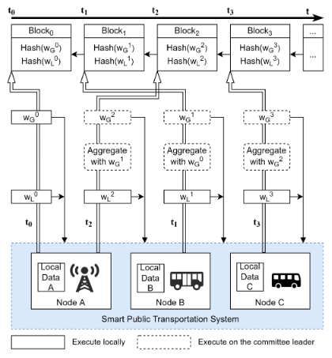

# DBAFL

### Entidades

- ônibus: Estabelecem conexões (veículo-RSU) e (veículo-veículo) quando estão dentro de uma região de sinal, permitindo-os transmitir certa quantidade de dados.
- RSUs (Unidade de beira de estrada): Maior poder computacional e de comunicação do que os ônibus. Também possuem conexão ethernet uma com outra
- Parada de ônibus: Equipada com sensores, pode ser considerada um tipo de RSU também.

### Objetivo

Ônibus e RSUs treinam modelos de machine learning colaborativamente para predizer o fluxo de tráfico e o tempo de espera para os passageiros nos pontos de ônibus, a fim de que os ônibus viagem de forma segura e eficiente.

Uma vez em que as condições mudam com o tempo, ônibus e RSU continuamente coletam dados através dos seus sensores para que possam treinar e atualizar o modelo de ML.

### Desafios

- O tempo de treino e a qualidade dos modelos dos ônibus e RSUs são diferentes em razões de diferenças de poder computacional e tamanhos dos datasets

- O tempo limitado de conexão entre (veículo-RSU) e (veículo-veículo) representam desafios de eficiência para o FL

- Já ataques de envenenamento e DDoS por atacantes na estrada representam desafios de confiabilidade

O artigo em questão desenvolve o DBAFL, um esquema de FL com um fator de escala dinâmico e um algoritmo de consenso em cima do esquema de AFL (Async Federated Learning) e do blockchain a fim de melhorar a performance de aprendizado, eficiência e confiabilidade.

### Descrição do funcionamento 

Os ônibus e RSU atuam como nós e treinam seus modelos locais com bases nos seus próprios dados. Após o treino, enviam o valor do hash do modelo local para a blockchain a fim de outros nós verificarem. Além disso, os ônibus enviam o modelo em si para a RSU mais próxima para a realização da agregação do modelo global. Durante a fase de agregação, o fator de escala dinâmico atribui pesos para os modelos locais de acordo com sua acuracia.

A RSUs são membros do comitê e podem ser elegíveis para líder do comitê de acordo com o algoritmo de consenso. A identidade do próximo líder é determinada no hash do bloco mais recente, não necessitando votação ou comunicação.

O comitê mantém um banco de dados distribuído com sincronização dos dados a fim de compartilhar modelos. O comitê também está encarregado de realizar a agregação sempre que um novo modelo for recebido.

# Fluxo

Vamos assumir três nós A (RSU), enquanto que B e C são ônibus em uma escala de tempo que vai de $t0 \rightarrow  t1 \rightarrow t2 \rightarrow t3$




Observação:

- $W_L^t$: modelo local em um tempo t
- $W_G^t$: modelo Global em um tempo t

Exemplo do fluxo:

1. No tempo $t_0$ o nó A treina o modelo local **$W_L^0$** e vira o modelo global **$W_G^0$**. O nó então envia o valor do hash de ambos os modelos (_Hash($W_L^0$)_ e _Hash($W_G^0$)_ )  para a blockchain a fim de criar o genesis block. Após receberem o hash do _$Block_0$_, cada nó faz o download do **$W_G^0$** do nó A e treina o seu modelo com base nos seus próprios dados. Ao mesmo tempo que isso acontece, um comitê é feito com base no valor do hash do _$Block_0$_.
2. No tempo $t_1$ o nó B finaliza seu treinamento e gera um novo modelo local **$W_L^1$**. Depois o nó B calcula o Hash($W_L^1$) e faz o upload para a blockhain. Além disso, o nó B envia o próprio modelo em si para a RSU mais próxima, a qual irá amarzenar o modelo em um banco de dados distribuído e compartilhar com o líder do comitê. Sem esperar os outros nós finalizarem, o comitê agrega **$W_G^0$** e **$W_L^1$** de acordo com o fator de escala dinâmica e produz o **$W_G^1$**. O líder do comitê então faz o uploud do Hash($W_G^1$) para a blockchain onde o _$Block_1$_ será criado. O modelo global **$W_G^1$** é então compartilhado com os membros do comitê via banco de dados distribuído.
3. No tempo $t_2$ o nó A finaliza o treino com base no ainda modelo global **$W_G^0$** e adquire um modelo obsoleto **$W_L^2$**. O nó A então faz o upload do Hash($W_L^2$) para a blockchain e compartilha o próprio modelo com o líder do comitê através do banco de dados distribuído. Com base no **$W_G^1$** e **$W_L^2$**, o comitê agrega gerando o novo modelo global **$W_G^2$** e envia o Hash do seu valor para a blockchain criando o _$Block_2$_.
4. Depois de algum tempo, no tempo $t_3$ o nó C finaliza o seu treino com base ainda no **$W_G^0$**. Apesar de obsoleto, o modelo local **$W_L^3$** é aceito pelo comitê. O nó C então envia o Hash para a blockchain. Após a realização da agregação entre o **$W_L^3$** e o **$W_G^2$**, o comitê gera o modelo global **$W_G^3$** e faz o uploud do seu hash para a blockchain criando então o _$Block_3$_
5. O processo então continua ...

# Fator de escala dinâmico

Já foi demonstrado em artigos anteriores que o peso dos modelos locais tem impacto significativo durante a fase de agregação na performance do Federated Learning

Então, se um modelo obsoleto local tiver uma baixa acurácia, não é interessante depender muito dele, pois pode prejudicar a performance do modelo global. Do contrário, se um modelo obsoleto local tiver alta acurácia, é interessante que ele tenha um impacto maior durante a agregação.

Um fator de escala dinâmico é então criado para atribuir um peso ao modelo local recém chegado no banco de dados distribuído. 

O fator é calculado entre o resultado do teste entre a acurácia do modelo recém chegado com o da acurácia do modelo local do líder do comitê (Alguma RSU) e dividido pelo resultado da acurácia do modelo global com a também acurácio do modelo local do líder. Um epsilon então é encontrado com base nesses dois valores. 

Observação:
- $A^t$: agregação em um tempo t
- $W_G^{t-1}$: Num tempo anterior $t-1$, na prática o modelo global mais atual

Epsilon é definido então como:

```math
\epsilon ^t = {A_L^t \over A_G^{t-1}}
```

O novo modelo global então será calculado da seguinte forma:

```math
W_G^t = {w_G^{t-1} + \epsilon^{t} * w_L^t \over 1 + \epsilon^t}
```

Dessa forma, se o valor da acurácia do modelo local for maior do que a do modelo global, epsilon será um valor grande. Tendo então um impacto maior na produção do modelo global. Já se for baixo, terá impacto menor.

# Consenso

A frequência em que novos líderes são eleitos varia de acordo com os requisistos de confiabilidade. A identidade do novo líder é calculdada com base no hash do último bloco.

Por exemplo, se um $Bloco_k$ for gerado na RSU 1, a identidade do novo líder é encontrada com base na realização do $Hash$ do $Bloco_K$ módulo $M$, em que $M$ é o número de RSUs.

$$Hash(Block_x) \ mod \ M $$

Somado a isso existe a frequência para escolha do líder do comitê. Se for 1/10, por exemplo, significa que a identidade do novo líder é calculada assim que 10 blocos são adicionados a blockchain.

Logo em seguida é demonstrado que a probilidade de qualquer RSU torna-se líder é uniforme. 

Se um modelo local baixado for modificado e inconsistente com o valor do hash guardado na blockchain, o líder do comitê irá ignorá-lo juntamente com todos os outros modelo locais que esse nó produzir até que um novo líder seja eleito. Além disso, todos os outros membros do comitê verificam o processo de agregação do modelo global a fim de prevenir um líder mal intencionado.


